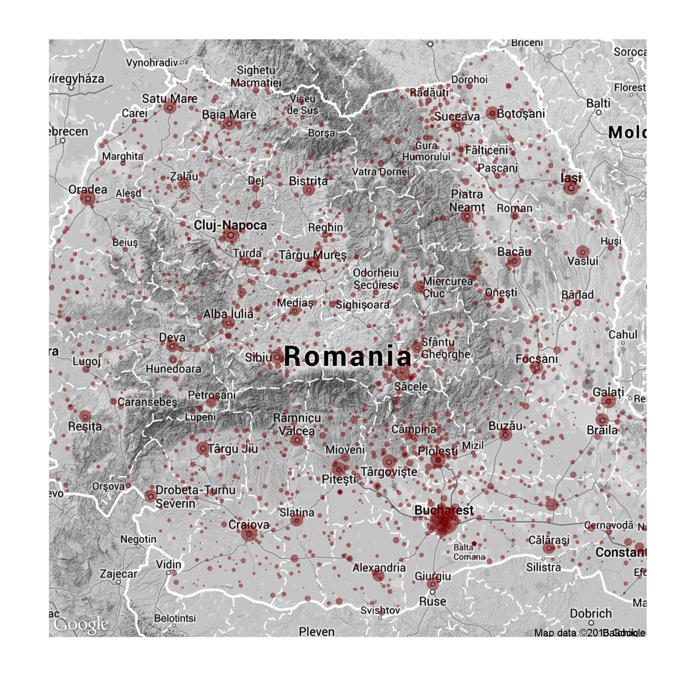
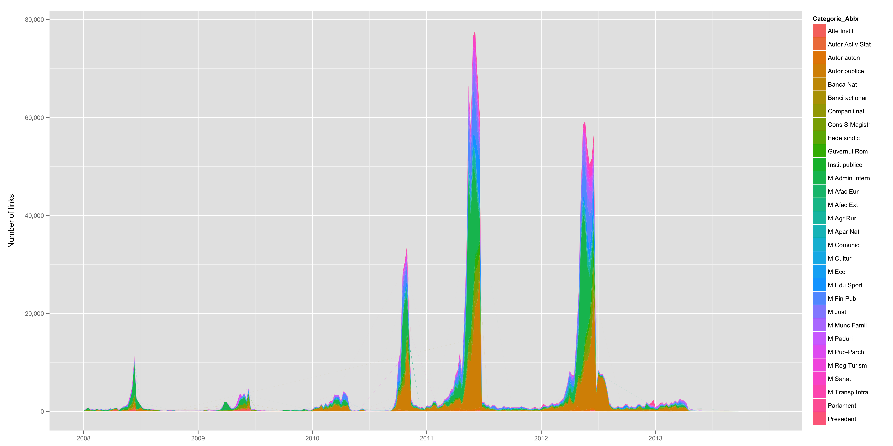

# README

R scripts to scrape and plot metadata from declarations filed with the Romanian [National Integrity Agency](http://integritate.eu/). Half of the data comes from four administrative bodies, one of which is local government. Geocoding the addresses with Google Maps returned this:



The preprocessed dataset holds _N_ = 1,406,789 links for 31 institutions. The final dataset and the plots exclude declarations from the European Parliament or from before 2008, both of which have very low counts. This breakdown shows how many declarations were filed in each institution, and when:



The data are not included in the repository, but you can [open an issue](issues) to request bits of it. Otherwise, just follow the `HOWTO` section below to run the scraper locally, replicate the plots, and download your own sample of declarations.

## HOWTO

1. The first entry point is the scraper, which runs in two consecutive scripts (run each of them with `source()`):

	1. `data.scraper.r` will download links for declarations from all institutions except for the two largest, which return server errors.
	2. `data.plots.r` will postprocess the declarations metadata to `integritate.rda` and export summary figures to the `plots` folder.

	The two missing institutions are the Central Election Bureau (_n_ ~ 9,000 pages) and uncategorized documents (_n_ ~ 9,000 pages). Both fail to scrape due to server-side issues with calling high page number values in the declarations search index.

2. The download function in `download.files.r` separately downloads the declarations, in PDF format:

	* the function requires that you pass the `data` object from `integritate.rda` to work, as well as a list of sampled categories.
	* by default, the function will just estimate the size of the download; set `list` to `FALSE` to actually download the files.
	* by default, the function sleeps 3 seconds between each download; set `sleep` to something between `1` to `60` to modify this.

Example usage:

```S
# load integritate.rda metadata object
load("integritate.rda")
str(data)

# load declarations download function
source("download.files.r")

# count all files in all ministries (takes a minute)
# ~ 825,000 files, 1.466 TB; huge total filesize
all_categories = unique(data$Categorie_Number[ grepl("Ministerul", data$Categorie)])
system.time(download.files(data, all_categories, tip = c("da", "di")))

# download DIs (interests) for Foreign Policy (8), 
# Communication (11) and European Affairs (35)
system.time(download.files(data, c(11, 35), sleep = 1, tip = "di", list = FALSE))
```

To get a breakdown of links by institution:

```S
load("integritate.rda")
str(data)
df = aggregate(URL ~ Categorie, length, data = data)
df[order(df$URL, decreasing = TRUE), ]
```

                                                        Categorie    URL
                          Ministerul Administratiei si Internelor 365329
                                               Autoritati publice 358892
                                    Ministerul Finantelor Publice 131070
                              Consiliul Superior al Magistraturii  71350
       Ministerul Educatiei, Cercetarii, Tineretului si Sportului  55187
                                             Ministerul Justitiei  52691
                Ministerul Muncii, Familiei si Protectiei Sociale  43704
                                               Companii nationale  39391
                                                Guvernul Romaniei  35654
                                    Ministerul Apararii Nationale  32700
                    Ministerul Agriculturii si Dezvoltarii Rurale  30891
                                     Ministerul Public - Parchete  26773
                                             Ministerul Sanatatii  26765
                                 Ministerul Mediului si Padurilor  21187
                                              Autoritati autonome  14582
                    Ministerul Transporturilor si Infrastructurii  13944
                                                  Alte Institutii   9999
                                             Parlamentul Romaniei   9985
          Ministerul Economiei, Comertului si Mediului de Afaceri   7187
                   Ministerul Dezvoltarii Regionale si Turismului   6605
                                               Institutii publice   5829
                                    Ministerul Afacerilor Externe   4497
                    Ministerul Culturii si Patrimoniului National   3012
           Ministerul Comunicatiilor si Societatii Informationale   2219
                              Federatii si confederatii sindicale   1656
                                   Ministerul Afacerilor Europene   1202
              Autoritatea pentru Valorificarea Activelor Statului   1091
                                       Banca Nationala a Romaniei   1039
                                             Presedentia Romaniei    524
    Banci la care statul este actionar majoritar sau semnificativ    106

The script `download.candidates.r` will produce a separate dataset for the [declarations of candidates to the 2012 legislative election](http://declaratii.integritate.eu/home/navigare/alegeri-2012.aspx), which is much quicker to parse than most of the other institutions handled by the main scraper.

All download functions are wrapped in failsafe `try()` functions and will skip existing files to protect data from previous scrapes. Scraping the links consistently returned [less than 0.01% errors](https://gist.github.com/briatte/8623901) in our data collection phase of late 2013.

> _Last edited 2014-01-25_
