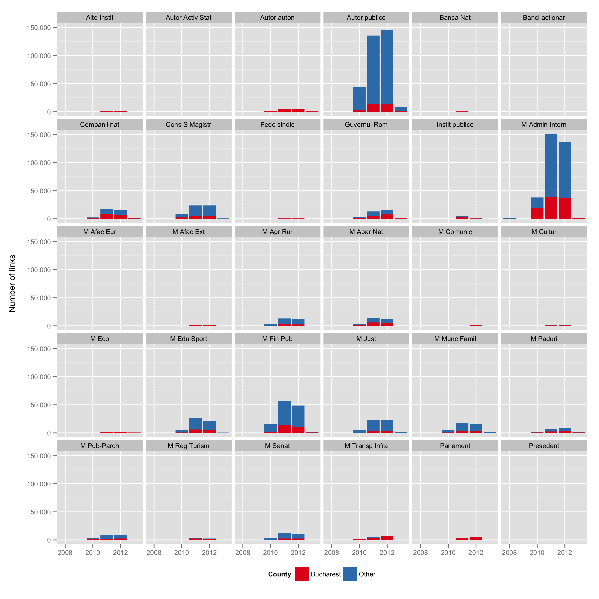

# README

R scripts to scrape, download and plot links from the Romanian [National Integrity Agency](http://integritate.eu/). The data come from a bit everywhere:

The current dataset holds _N_ = 1,411,736 links for 30 institutions from 2008 to 2013:

The data are not included in the repository, but you can [open an issue](issues) to request it.

## HOWTO

The main entry point is `0.scrape.r`. Make sure to review the opening parameters. This will trigger `1.tables.r` to download the tables, and `2.plots.r` to visualize the aggregated data. The download loop in `3.download.r` for the PDF files should be run separately.

All download functions are wrapped in failsafe `try()` functions and will skip existing files to protect data from previous scrapes. The PDF download loop will also sleep a few seconds between each file.

The scripts were tested by scraping over 1.5 million links for categories `1:23`, `26:32` and `35`. The missing categories are the Central Election Bureau (_n_ ~ 9,000 pages) and uncategorized documents (_n_ ~ 9,000 pages).

Breakdowns by origin and type:

Breakdown by institution: 

    > load("integritate.rda")
    > df = aggregate(URL ~ Categorie, length, data = data)
    > df[order(df$URL, decreasing = TRUE), ]
                                                        Categorie    URL
                          Ministerul Administratiei si Internelor 365329
                                               Autoritati publice 358892
                                    Ministerul Finantelor Publice 131070
                              Consiliul Superior al Magistraturii  71350
       Ministerul Educatiei, Cercetarii, Tineretului si Sportului  55187
                                             Ministerul Justitiei  52691
                Ministerul Muncii, Familiei si Protectiei Sociale  43704
                                               Companii nationale  39391
                                                Guvernul Romaniei  35654
                                    Ministerul Apararii Nationale  32700
                    Ministerul Agriculturii si Dezvoltarii Rurale  30891
                                     Ministerul Public - Parchete  26773
                                             Ministerul Sanatatii  26765
                                 Ministerul Mediului si Padurilor  21187
                                              Autoritati autonome  14582
                    Ministerul Transporturilor si Infrastructurii  13944
                                                  Alte Institutii   9999
                                             Parlamentul Romaniei   9985
          Ministerul Economiei, Comertului si Mediului de Afaceri   7187
                   Ministerul Dezvoltarii Regionale si Turismului   6605
                                               Institutii publice   5829
                                    Ministerul Afacerilor Externe   4497
                    Ministerul Culturii si Patrimoniului National   3012
           Ministerul Comunicatiilor si Societatii Informationale   2219
                              Federatii si confederatii sindicale   1656
                                   Ministerul Afacerilor Europene   1202
              Autoritatea pentru Valorificarea Activelor Statului   1091
                                       Banca Nationala a Romaniei   1039
                                             Presedentia Romaniei    524
    Banci la care statul este actionar majoritar sau semnificativ    106

The breakdowns exclude declarations from the European Parliament, or from before 2008. In both cases, the number of links is very low and the data are probably not representative.

The script `4.elections.r` will produce a separate dataset for the [declarations of candidates to the 2012 legislative election](http://declaratii.integritate.eu/home/navigare/alegeri-2012.aspx).

## NOTES

Backup line for the extended repo (code, processed dataset, figures):

    zip(paste0("integritate_", Sys.Date(), ".zip"),    # file name
        files = dir(pattern = ".r$|.rda$|.Rproj$|README|fig"))

From a sample of slightly below 2,000 files filled in by employees of the Ministry of External Affairs, average PDF file size is about 1.7 MB.

> _Last edited 2013-12-25_
